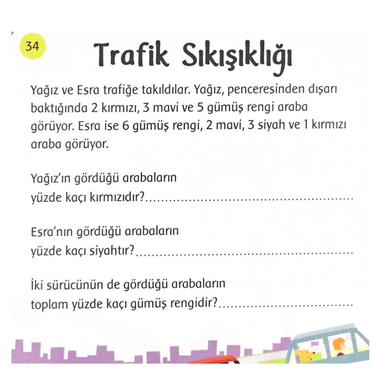
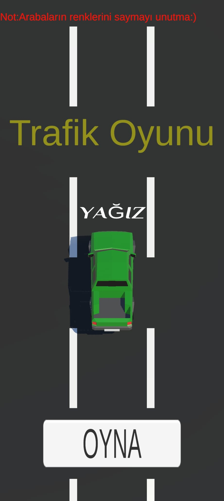
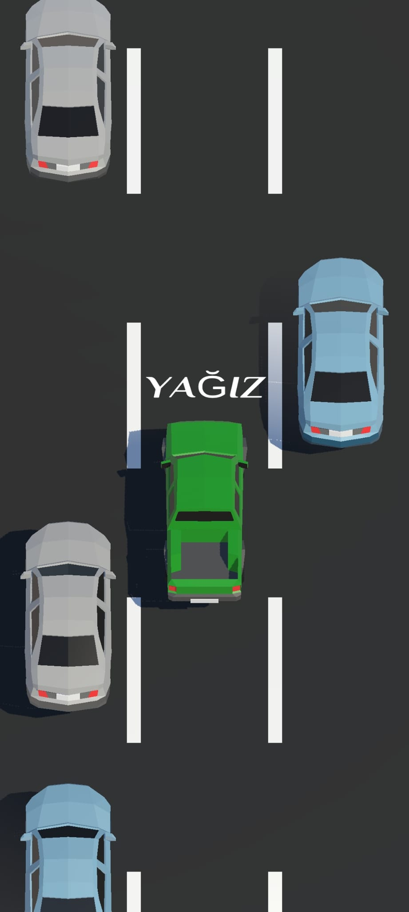
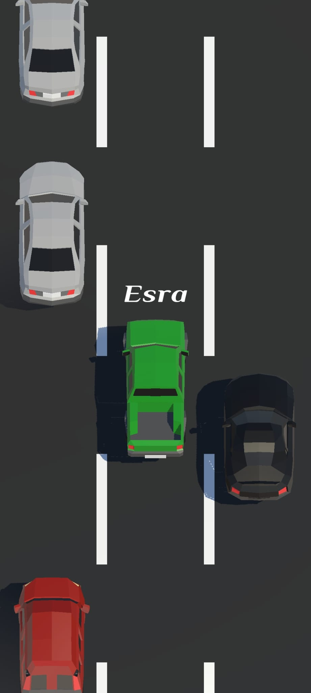
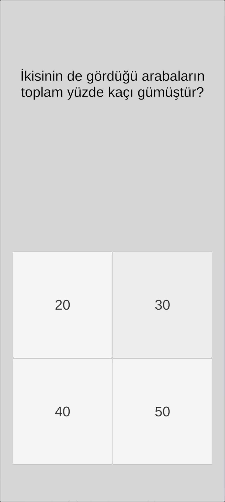
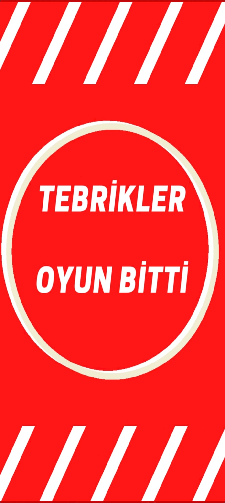

# GERÇEK YETENEK
Bu proje, Doğukan Özcan tarafından Fırat Üniversitesi Yazılım Mühendisliği Güncel Konular dersi finali için geliştirilen bir proje mobil oyunudur. Oyunun adı 'Trafik Oyunu' olarak belirlenmiştir ve 'Mobil' platformda çalışmaktadır.
## Kullandığım programlar ve diller
- Unity
- Visual Studio 2019
- C#
## PROJE KONUSU OLAN KART

  

## Oyun amacı
- Yolda seyir halinde olan arabaları sayma ve renklerine göre kategori etme
- İstenilen sonucu toplam sayıya oranlama
- Başarılı olana kadar ilerleme sağlayamama
- Verilen konuya uygunluk
- Hitap etmesi gereken kitleye uygunluk
## Özellikler
- Zeka geliştirici matematik soruları
- Gelişim çağında etki gösteren
- İşlem yapma yeteneklerini geliştirmek için güçlendirmeler
- Başarı ekranı
- Oyun içi ses
## Prototip (TrafikOyunu.apk) ve eski sürümler
<a href="https://drive.google.com/drive/folders/1UEuZNfrFgWqmJwJ6_AmKouUhX_6YLtqF?usp=sharing" target="_blank" onclick="window.open('https://drive.google.com/drive/folders/1UEuZNfrFgWqmJwJ6_AmKouUhX_6YLtqF?usp=sharing'); return false;">Prototipi indirmek için tıklayın</a>
## Video
<a href="https://drive.google.com/file/d/1CFLVuAh2Q58p3Hk_Zxjqf0wPq5EExMLy/view?usp=sharing" target="_blank" onclick="window.open('https://drive.google.com/file/d/1CFLVuAh2Q58p3Hk_Zxjqf0wPq5EExMLy/view?usp=sharing'); return false;">Tanıtım için tıklayın</a> 
# Dökümanlar
Bu projenin gerekli dökümantasyonuna <a href="" target="_blank" onclick="window.open(''); return false;">buraya tıklayarak</a> erişebilirsiniz
### Oyun içerisinden görüntüler
      
